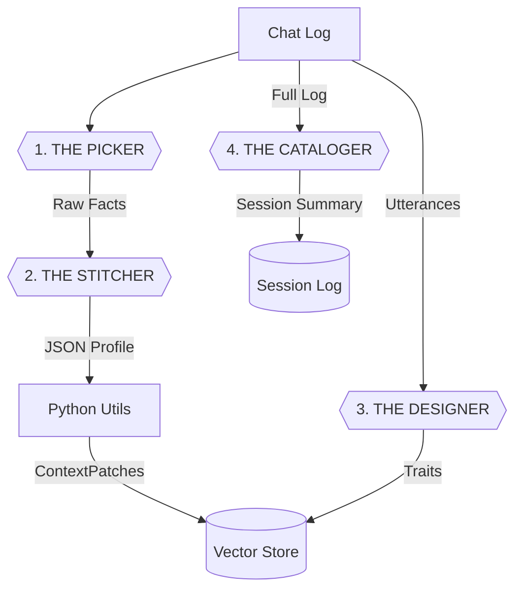

# Context Quilt: Adaptive Context Pipeline

## 1. System Overview

**Context Quilt** is a privacy-first context intelligence pipeline designed to run on a single local LLM. It transforms raw chat logs into structured, queryable data (Context Patches) and behavioral profiles.

### **The Engine**

  * **Model:** `Qwen2.5-Coder-7B-Instruct-GGUF`
  * **Quantization:** `q4_k_m` (Recommended balance of speed/accuracy)
  * **Architecture:** Single-model pipeline handling Extraction, Normalization, Profiling, and Cataloging.

### **The Pipeline Flow**

## 2. The Prompts (Golden Copies)

See `src/contextquilt/prompts.py` for variables:
- `PICKER_PROMPT`
- `STITCHER_PROMPT`
- `DESIGNER_PROMPT`
- `CATALOGER_PROMPT`

## 3. The Safety Layer (Python)

See `src/contextquilt/utils/context_quilt_utils.py` for functions:
- `repair_and_parse_json`
- `prune_invalid_values`
- `transform_to_patches`
